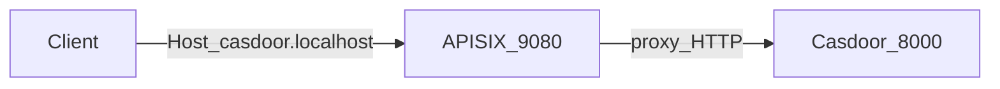

# Casdoor + APISIX integration plan

## Constraint (drives the design)

Casdoor **does not support subpath deployment** (e.g. `http://localhost:9080/casdoor/`). It expects to be served at a **virtual host root** ([upstream discussion](https://github.com/casdoor/casdoor/issues/2147)). Therefore **do not** plan a single route like `uri: /casdoor/*` → Casdoor unless you accept broken redirects and static assets.

**Recommended pattern:** use **APISIX host-based routing**: clients use a dedicated hostname (e.g. `casdoor.localhost`) on port **9080**, with `Host: casdoor.localhost`, and APISIX proxies to `casdoor:8000`. Set Casdoor’s **`origin`** / **`originFrontend`** to that same public URL so OAuth redirects and links match.

## Step 1: Add Casdoor to Docker Compose

**Target file:** [`docker-compose.yml`](c:\Users\user\source\repos\APISIXwithNET\docker-compose.yml)

- Add a **`casdoor`** service on the existing **`apisix`** network so APISIX can resolve `http://casdoor:8000`.
- **Image choice (pick one in implementation):**
  - **`casbin/casdoor-all-in-one`** (pinned tag): minimal setup, embedded DB — suitable for **local dev / demo** ([docs](https://casdoor.org/docs/basic/try-with-docker/)).
  - **`casbin/casdoor` + `mysql`**: closer to production; requires `conf/app.conf` and DB init — more moving parts.
- **Default recommendation for this repo:** **all-in-one** to keep compose small; document that production should use external DB + `casbin/casdoor`.
- **Port publishing:**
  - **Optional** `8000:8000` for direct UI access during first-time setup (bypassing APISIX). If you want **only** gateway access, omit host port and rely on APISIX + `docker exec` / internal network.
- **Configuration:** mount a **`casdoor_conf/app.conf`** (copy from [upstream `conf/app.conf`](https://github.com/casdoor/casdoor/blob/master/conf/app.conf) for the non-all-in-one case; for all-in-one, confirm whether mount overrides embedded config — if the image ignores mount, use env vars documented in [Casdoor Docker deployment](https://casdoor.org/docs/deployment/docker/) or switch to standard image + MySQL).

Set at least:

- `origin = http://casdoor.localhost:9080` (or your chosen hostname + port)
- `originFrontend = http://casdoor.localhost:9080` (if used by your Casdoor version for UI)

**Hosts file (document in README):** on Windows, add `127.0.0.1 casdoor.localhost` so `http://casdoor.localhost:9080` resolves.

## Step 2: APISIX Dashboard — manual setup (route + “port”)

Clarify for readers: APISIX listens on **9080** for HTTP; you do not assign Casdoor a **separate listener port** unless you add another `node_listen` in [`apisix_conf/config.yaml`](c:\Users\user\source\repos\APISIXwithNET\apisix_conf\config.yaml). The usual approach is **one port (9080), multiple routes distinguished by `host`**.

**Upstream (Dashboard)**

- **Name:** e.g. `casdoor-upstream`
- **Nodes:** `casdoor` / **8000**, scheme **http**, round-robin (single node is fine).

**Route (Dashboard)**

- **Name / desc:** e.g. `casdoor`, `Proxy Casdoor OAuth UI and APIs`
- **Request Basic Define:**
  - **Host** (or **Hosts**): `casdoor.localhost` (must match `origin` hostname)
  - **URI:** `/*`
  - **Methods:** include `GET`, `POST`, `PUT`, `DELETE`, `PATCH`, `OPTIONS` (Casdoor UI and OAuth/token endpoints use these)
- **Upstream:** bind `casdoor-upstream`
- **Plugins (if needed):** If OAuth redirects or cookies misbehave, add/configure proxy-related headers (`X-Forwarded-Proto`, `X-Forwarded-Host`, `X-Real-IP`) per [Casdoor behind Nginx](https://casdoor.org/docs/deployment/nginx/) concepts — APISIX equivalents may be the **proxy-control** / **proxy-rewrite** or **serverless** header plugins depending on version; keep defaults first, then tune.

**Optional raw JSON** (for Admin API / Raw Editor): same structure as your existing [`task-api` route example](c:\Users\user\source\repos\APISIXwithNET\README.md): `hosts: ["casdoor.localhost"]`, `uri: /*`, `upstream` → `casdoor:8000`.

## Step 3: Access Casdoor through APISIX and obtain `access_token` + `refresh_token`

Document OAuth endpoints with **`CASDOOR_HOST` = `http://casdoor.localhost:9080`** (through APISIX).

Per [Casdoor OAuth 2.0 docs](https://casdoor.org/docs/how-to-connect/oauth/):

1. **Casdoor admin (first login):** default `built-in` / `admin` and password `123` (change immediately) when using all-in-one — confirm against current image docs.
2. **Create an Application** in Casdoor: note **Client ID**, **Client Secret**, enable **Authorization Code** (and **Refresh Token** expiration if you need refresh tokens).
3. **Redirect URI:** must match what your client uses, e.g. `http://localhost:3000/callback` or a test `https://oauthdebugger.com/debug` — must be whitelisted in the Casdoor application.

**Authorization Code flow (browser + backend):**

- Open:  
  `http://casdoor.localhost:9080/login/oauth/authorize?client_id=...&redirect_uri=...&response_type=code&scope=openid&state=...`
- Exchange code at:  
  `POST http://casdoor.localhost:9080/api/login/oauth/access_token`  
  Body JSON: `grant_type`, `client_id`, `client_secret`, `code`  
  Response includes **`access_token`**, **`refresh_token`** (if enabled), **`id_token`**, etc.

**Refresh:**

- `POST` to Casdoor’s refresh endpoint (document exact path from your Casdoor version — docs reference **`/api/login/oauth/refresh_token`** with `grant_type: refresh_token` in the [Refresh Token](https://casdoor.org/docs/how-to-connect/oauth/) section; verify in running instance if needed).

**Quick API-only test (optional):** **Resource Owner Password** grant to `.../api/login/oauth/access_token` with `grant_type: password` — only if enabled on the Application (good for curl demos, not for production browsers).

Append **curl** / **PowerShell** examples to [`README.md`](c:\Users\user\source\repos\APISIXwithNET\README.md) mirroring your existing Testing section style.

## Files to add or change

| Item | Action |
|------|--------|
| [`docker-compose.yml`](c:\Users\user\source\repos\APISIXwithNET\docker-compose.yml) | Add `casdoor` service, network, optional volume / env |
| `casdoor_conf/app.conf` | New (if required by chosen image) — set `origin` / `originFrontend` to public APISIX URL |
| [`README.md`](c:\Users\user\source\repos\APISIXwithNET\README.md) | New sections: hosts file, Dashboard upstream/route, Casdoor app setup, OAuth + refresh examples, troubleshooting (redirect mismatch, Host header) |

## Risks / notes

- **Origin mismatch:** If `origin` does not match the browser URL (scheme, host, port), OAuth **redirect_uri** validation fails.
- **HTTPS:** Local demo uses HTTP; production should terminate TLS and set `X-Forwarded-Proto: https` accordingly.
- **All-in-one vs configurable:** If all-in-one resists `app.conf` overrides, implement **`casbin/casdoor` + MySQL** with a known-good `app.conf` (official compose pattern) — slightly more YAML but predictable.
