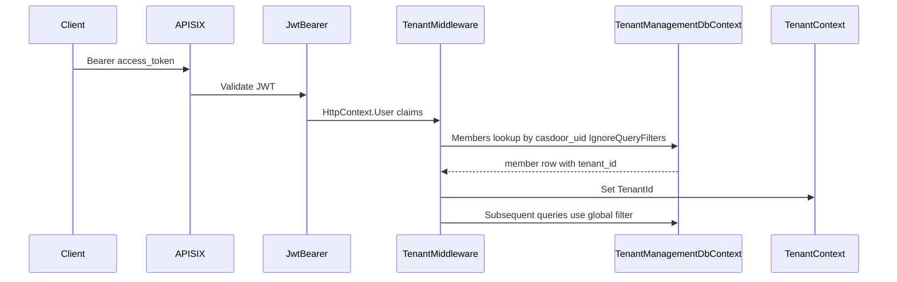

# Phase 2 Execution Plan: Tenant Isolation and Recursive Org Logic

## Goals (from your prompt)

- **Tenant isolation middleware**: Resolve `tenant_id` from `members` using JWT `casdoor_uid`, expose it on a scoped `TenantContext`.
- **Global query filters**: EF Core automatically scopes `OrgUnit`, `Member`, and `ServiceNode` to `tenant_id = TenantContext.TenantId`.
- **Org units API**: CRUD-style management plus **one** organogram read that uses a **recursive CTE** and returns **nested JSON** for React.

## Current baseline (relevant files)

- App pipeline: [`TenantManagement/Program.cs`](C:/Users/DELL/source/repos/APISIXwithNET/APISIXwithNET/TenantManagement/Program.cs) — JWT auth; no tenant middleware yet.
- DbContext: [`TenantManagement/Data/TenantManagementDbContext.cs`](C:/Users/DELL/source/repos/APISIXwithNET/APISIXwithNET/TenantManagement/Data/TenantManagementDbContext.cs) — entities already have `tenant_id` on `OrgUnit`, `Member`, `ServiceNode`.
- User identity: [`TenantManagement/Services/UserContextAccessor.cs`](C:/Users/DELL/source/repos/APISIXwithNET/APISIXwithNET/TenantManagement/Services/UserContextAccessor.cs) (pattern to reuse for `sub` / email).

## Architecture (request flow)



## 1) `TenantContext` and membership resolution

- Add [`TenantManagement/Services/TenantContext.cs`](C:/Users/DELL/source/repos/APISIXwithNET/APISIXwithNET/TenantManagement/Services/TenantContext.cs) (or equivalent): scoped mutable holder with `Guid? TenantId` and maybe `bool IsResolved`.
- Register `AddScoped<TenantContext>()`.
- **Middleware** [`TenantManagement/Middleware/TenantResolutionMiddleware.cs`](C:/Users/DELL/source/repos/APISIXwithNET/APISIXwithNET/TenantManagement/Middleware/TenantResolutionMiddleware.cs) (name flexible):
  - Run **after** `UseAuthentication()` and **before** `UseAuthorization()` (or immediately after auth; either way claims must exist).
  - If user is not authenticated: skip (or leave `TenantId` null).
  - If authenticated: read `casdoor_uid` the same way as [`UserContextAccessor`](C:/Users/DELL/source/repos/APISIXwithNET/APISIXwithNET/TenantManagement/Services/UserContextAccessor.cs) (`sub` / `ClaimTypes.NameIdentifier`).
  - Query `members` for that UID and set `TenantContext.TenantId`.
  - **Important**: this lookup must use **`IgnoreQueryFilters()`** on `Members` (see section 2), because filters are not set yet and `TenantId` on the context may still be null.

**Edge cases to define in implementation**

- Member row missing (user signed in but not onboarded): leave `TenantId` null; org endpoints return **403** or **404** with a clear JSON body (align with Phase 1 `onboarded=false` semantics).
- Optional: short-circuit `OPTIONS` requests for CORS.

## 2) EF Core global query filters

- Inject `TenantContext` into [`TenantManagementDbContext`](C:/Users/DELL/source/repos/APISIXwithNET/APISIXwithNET/TenantManagement/Data/TenantManagementDbContext.cs) (constructor injection alongside `DbContextOptions`).
- In `OnModelCreating`, add `HasQueryFilter` for:
  - `OrgUnit`: `e => e.TenantId == _tenantContext.TenantId`
  - `Member`: same
  - `ServiceNode`: same

**Null `TenantId` behavior**: EF translates `== null` to SQL `IS NULL`, which would incorrectly return rows. Mitigation (pick one, document in code):

- **Recommended**: make the filter `e => _tenantContext.TenantId != null && e.TenantId == _tenantContext.TenantId.Value` so unscoped queries return **empty** when tenant is not resolved.
- Ensure **every** code path that must bypass the filter (middleware membership lookup, optional admin) uses `IgnoreQueryFilters()` explicitly.

**Out of scope for the literal filter list** (your prompt names only three entities): `member_assignments`, `member_meta`, and `service_configs` have no `tenant_id`. Plan: access them only via navigations from filtered entities, or add explicit tenant checks in services when using direct `DbSet` queries—otherwise cross-tenant leakage is possible. Phase 2 can document “use filtered parents” as the rule.

## 3) DbContext registration change

- Switch to `AddDbContext<TenantManagementDbContext>` with injected `TenantContext` — the built-in DI will resolve scoped `TenantContext` per request when constructing the context.

## 4) Org units API surface

Add a controller under something like [`TenantManagement/Controllers/OrgUnitsController.cs`](C:/Users/DELL/source/repos/APISIXwithNET/APISIXwithNET/TenantManagement/Controllers/OrgUnitsController.cs):

- **`[Authorize]`** on all actions.
- Require `TenantContext.TenantId` has value; otherwise return **403** with a stable error code/message.
- Suggested routes (adjust to your API style; gateway remains `/tenant/...` per README):
  - `GET /api/org-units/tree` — nested JSON (primary Phase 2 deliverable).
  - `POST /api/org-units` — create child or root (`parent_id` optional).
  - `PUT /api/org-units/{id}` — rename / change `unit_type` (optional Phase 2).
  - `DELETE /api/org-units/{id}` — optional; define cascade vs block-if-children.

Validation: `parent_id` (if set) must belong to same tenant (filter handles reads; verify on write).

## 5) Recursive CTE + nested JSON

**SQL (PostgreSQL)**

- Implement a raw SQL query using `WITH RECURSIVE org_tree AS (...)` selecting from `org_units` where `tenant_id = @tenantId`, walking `parent_id` relationships (typically anchor roots `parent_id IS NULL`, then recurse to children; or anchor all rows and recurse upward—choose one consistent direction).

**Two implementation options**

1. **CTE returns flat rows** (`id`, `parent_id`, `name`, `unit_type`, `depth` or `path`): build the nested DTO tree in C# with a dictionary `id -> node` and a single pass—simple and testable.
2. **CTE + windowing** only if you need ordering; still materialize nested JSON in C#.

**EF Core execution**

- Use `Database.SqlQueryRaw<OrgUnitFlatDto>(...)` (.NET 9 / EF9) or `FromSqlRaw` mapped to a keyless entity type—whichever matches your EF package version in [`TenantManagement.csproj`](C:/Users/DELL/source/repos/APISIXwithNET/APISIXwithNET/TenantManagement/TenantManagement.csproj).

**Response shape** (example)

```json
{
  "nodes": [
    {
      "id": "...",
      "name": "Root",
      "unitType": "Department",
      "children": [ ... ]
    }
  ]
}
```

Return roots only at top level (`parent_id` null), children nested.

## 6) Wire-up in [`Program.cs`](C:/Users/DELL/source/repos/APISIXwithNET/APISIXwithNET/TenantManagement/Program.cs)

- `app.UseAuthentication();`
- `app.UseMiddleware<TenantResolutionMiddleware>();` (or extension method)
- `app.UseAuthorization();`

## 7) Tests and manual verification

- **Unit/integration** (optional but valuable): in-memory or test container Postgres—middleware sets tenant; filtered query cannot see other tenant’s rows.
- **Manual** (through APISIX): after Phase 1 onboarding, `GET http://localhost:9080/tenant/api/org-units/tree` with Bearer token returns nested structure; second tenant’s token cannot read first tenant’s units.

## 8) README (optional doc touch)

- Add a short subsection under existing TenantManagement docs: new endpoints, note that `/api/me` may use `IgnoreQueryFilters` internally if you align membership reads with filters.

## Risk register

| Risk | Mitigation |
|------|------------|
| Global filter + null TenantId | Use `TenantId != null &&` in filter expression |
| Middleware vs filter chicken-and-egg | `IgnoreQueryFilters` for membership lookup only |
| Child tables without `tenant_id` | Query via filtered parents or add explicit checks |

## Files likely touched (summary)

- New: `TenantContext`, `TenantResolutionMiddleware`, `OrgUnitsController`, DTOs for tree response, possibly `IOrganogramService`.
- Modify: [`TenantManagementDbContext.cs`](C:/Users/DELL/source/repos/APISIXwithNET/APISIXwithNET/TenantManagement/Data/TenantManagementDbContext.cs), [`Program.cs`](C:/Users/DELL/source/repos/APISIXwithNET/APISIXwithNET/TenantManagement/Program.cs).
- No changes to [`TaskApi`](C:/Users/DELL/source/repos/APISIXwithNET/APISIXwithNET/TaskApi/) per your constraint.
