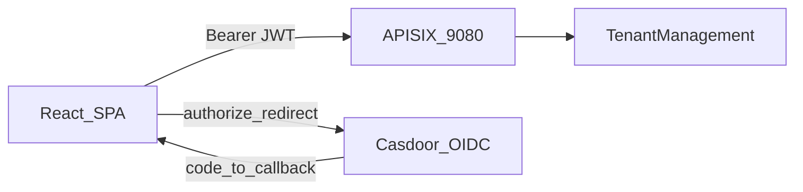

# Phase 3 Execution Plan: React One-Screen Configurator

## Scope and baseline

- **Frontend**: new **Vite + React + TypeScript** app inside this repo (per your choice), using **React Router** for `/`, `/callback` (OAuth), `/organization-setup`, etc.
- **Gateway**: existing APISIX prefix **`/tenant/*`** → TenantManagement (see [`apisix_conf/route-tenantmanagement-example.json`](C:/Users/DELL/source/repos/APISIXwithNET/APISIXwithNET/apisix_conf/route-tenantmanagement-example.json) and [`README.md`](C:/Users/DELL/source/repos/APISIXwithNET/APISIXwithNET/README.md)). Frontend should call APIs as **`/tenant/api/...`** (or configurable `VITE_API_BASE_URL`).
- **Backend today**: [`TenantManagement`](C:/Users/DELL/source/repos/APISIXwithNET/APISIXwithNET/TenantManagement) exposes `GET /api/me`, tenant create, org-units tree/CRUD ([`OrgUnitsController.cs`](C:/Users/DELL/source/repos/APISIXwithNET/APISIXwithNET/TenantManagement/Controllers/OrgUnitsController.cs)). It does **not** yet expose `GET /api/members/unassigned`, `POST /api/assignments`, invitation APIs, or meta/service-config write APIs—those must be added for Phase 3 as described below.

## A) Backend (TenantManagement) — APIs required by the UI

Implement in [`TenantManagement`](C:/Users/DELL/source/repos/APISIXwithNET/APISIXwithNET/TenantManagement), reusing existing **[`TenantContext`](C:/Users/DELL/source/repos/APISIXwithNET/APISIXwithNET/TenantManagement/Services/TenantContext.cs)** + global filters from Phase 2.

### A1) Members: unassigned list

- **`GET /api/members/unassigned`**
  - **Auth**: `[Authorize]`, require onboarded tenant (`TenantContext.TenantId`), else `403` with stable `code` (same pattern as org-units).
  - **Definition of unassigned**: members in current tenant with **no** `member_assignments` row (use `!m.Assignments.Any()` or left join).
  - **Response**: minimal DTOs: `member_id`, `email`, `status`, etc.

### A2) Assignments: drag-drop

- **`POST /api/assignments`**
  - Body: `{ memberId, orgUnitId, designation? }` (align names with JSON camelCase).
  - Validate both IDs belong to current tenant via filtered `DbSet`s (or explicit tenant checks).
  - Enforce uniqueness on `(member_id, org_unit_id)` per existing unique index in [`TenantManagementDbContext`](C:/Users/DELL/source/repos/APISIXwithNET/APISIXwithNET/TenantManagement/Data/TenantManagementDbContext.cs).
  - Optional: idempotency (if assignment exists, return `200` with existing row).

### A3) Member meta (right panel)

- **`GET /api/members/{memberId}/meta`**
- **`PUT /api/members/{memberId}/meta`** (replace key set) **or** `POST`/`DELETE` per row—pick one; simplest is **PUT** with `{ entries: [{ metaKey, metaValue }] }`.
  - Tenant-safe: member must be in current tenant (Member query is filtered).

### A4) Service catalog + service config (right panel for org unit)

Minimal data for the UI:

- **`GET /api/service-nodes/tree`** (or flat list + parent pointers): read `service_nodes` for tenant (filtered).
- **`PUT /api/service-configs`** or **`POST /api/service-configs`**: upsert mapping `{ serviceNodeId, assignedOrgUnitId, slaHours, priority }` with validation under tenant filters.

If you want to avoid building a full service-node editor in Phase 3, ship **read-only service tree** + **upsert config** only.

### A5) Invitations (CRM_Head → email → Casdoor signup → accept)

This needs **new persistence** (EF migration), e.g. table `member_invitations`:

- `id`, `tenant_id`, `email`, `token` (random secret hash or opaque id), `status` (`Pending`/`Accepted`/`Revoked`), `created_by_member_id`, `expires_at`, `created_at`
- Optional: `casdoor_uid` populated on accept

**Endpoints**

- **`POST /api/invitations`** (role: **CRM_Head** only — match existing `members.status == "CRM_Head"` from Phase 1)
  - Body: `{ email }`
  - Creates invitation + returns **`acceptUrl`** for dev (and logs it if email not configured).

- **`GET /api/invitations/validate?token=...`** (authenticated)
  - Returns invitation summary if token valid and matches logged-in user email (or allows pre-accept display).

- **`POST /api/invitations/accept`**
  - Body: `{ token }`
  - Validates token, not expired, email matches JWT email claim, user not already a member.
  - **Inserts `members` row** for current `casdoor_uid` + email + tenant_id + appropriate `status` (e.g. `Member`).
  - Marks invitation accepted.

**Casdoor redirect wiring (plan-level behavior)**

- React “invitation link” should navigate to your SPA with `?inviteToken=...`, then immediately start/normal-complete OIDC login.
- Configure Casdoor Application **Signup** + **Redirect URI** to the SPA callback (`http://localhost:5173/callback` in dev).
- After signup/login, SPA reads `inviteToken` from `sessionStorage` (stored before redirect) and calls **`POST /api/invitations/accept`**; show modal “Accept invitation to {tenant}?”.

**Email sending**

- Phase 3 plan default: **do not require SMTP**—return `acceptUrl` in API response for manual testing; optional follow-up: SMTP/provider integration.

### A6) CORS (dev)

- Add CORS policy in [`TenantManagement/Program.cs`](C:/Users/DELL/source/repos/APISIXwithNET/APISIXwithNET/TenantManagement/Program.cs) allowing `http://localhost:5173` (Vite) when calling TenantManagement **directly** during dev.
- If the browser calls only **`http://localhost:9080/tenant/...`**, CORS is determined by APISIX + API responses—verify preflight; adjust APISIX route plugins if needed (`cors` plugin) when testing through gateway.

## B) Frontend (new Vite app)

Create e.g. [`tenant-portal/`](C:/Users/DELL/source/repos/APISIXwithNET/APISIXwithNET/tenant-portal) (name flexible) with:

### B1) Dependencies

- `react-router-dom`
- `@xyflow/react` (current React Flow package) **or** `reactflow` (match install docs; prefer **`@xyflow/react`** for React 18+/19)
- `zustand`
- Optional: `@tanstack/react-query` (nice for polling); otherwise `setInterval` + `fetch`

### B2) Auth token plumbing

- Implement **Authorization Code + PKCE** against Casdoor using **public client** settings (store **no client secret** in SPA).
- Store **`access_token`** (memory + `sessionStorage` optional) and attach **`Authorization: Bearer`** to all API calls via a small `apiFetch()` wrapper.
- **Base URL**: `import.meta.env.VITE_API_BASE` defaulting to `http://localhost:9080/tenant`.

### B3) Landing logic

- On app load, call **`GET /api/me`** with bearer token.
  - If `onboarded: false` → render **Setup Company** form → `POST /api/tenants` (already exists).
  - If `onboarded: true` → **Dashboard** shell.

### B4) Page: **Organization Setup** (one screen)

Layout: **3 columns**

- **Left panel**: fetch **`GET /api/members/unassigned`** on mount and **every 5 seconds** (`setInterval`, clear on unmount). Show draggable list items (member id + email).
- **Center (React Flow)**:
  - Fetch org tree: **`GET /api/org-units/tree`** (existing).
  - Map nodes: `id`, `position` derived deterministically (simple layout: layered by depth, or use `dagre` only if needed—keep Phase 3 simple with a layered layout).
  - **Colors**: `unitType === "Department"` → blue styling; `Team` → green; default gray for unknown types.
  - **Click node**: open modal/panel action “Add Child Unit” (calls existing `POST /api/org-units` with `parentId`).
  - **Right-click context menu** on node: “Add Sub-Department” / “Add Team” (same POST with `unitType` preset).
  - **Drag member → drop on node**:
    - Use React Flow drag/drop (`onDragStart` on list + `onDrop`/`onDragOver` on pane/node) or HTML5 DnD.
    - On drop: `POST /api/assignments` then refresh unassigned list + tree.

- **Right panel (inspector)**:
  - If **node selected**: edit **ServiceConfig** mapping (service subcategory selection + org unit id implicit).
  - If **member selected** (from left list or a future on-canvas member node): edit **MemberMeta** key/values.
  - Persist via the new member meta + service config endpoints.

### B5) Invitation UX (CRM_Head)

- Dashboard section: invite form (email) calling **`POST /api/invitations`**.
- Display returned **`acceptUrl`** for testing.
- Invitee flow: open URL → login/signup via Casdoor → lands on Organization Setup → modal calls **`POST /api/invitations/accept`**.

## C) Documentation

- Extend [`README.md`](C:/Users/DELL/source/repos/APISIXwithNET/APISIXwithNET/README.md) with:
  - how to run Vite dev server
  - required Casdoor redirect URIs for the SPA
  - example curl calls for new endpoints (under `/tenant/api/...`)

## D) Verification checklist

- Unassigned members poll works (5s) and stops on unmount.
- Drag-drop creates assignment and removes user from unassigned list.
- Tree reload shows updated structure (or optimistic update + refetch).
- Non-CRM user cannot invite (403).
- Invitee after signup becomes a member only after **accept** call.
- All requests include bearer token.

## Implementation todos
