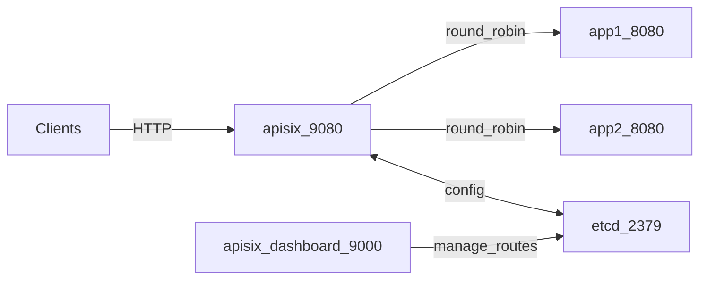

# APISIXwithNET

A .NET 8 Web API sample (tasks CRUD, Server-Sent Events, WebSocket echo) fronted by **Apache APISIX 3.x**, with **etcd 3.5** for configuration and the **APISIX Dashboard** for managing routes.

## Architecture



- **Data plane**: Clients call `http://localhost:9080` (APISIX). APISIX load-balances to two identical **TaskApi** containers (`app1`, `app2`) on port **8080**.
- **Control plane**: **APISIX** and **APISIX Dashboard** both use **etcd** as the configuration store (`/apisix` prefix).

## Prerequisites

- [Docker](https://docs.docker.com/get-docker/) with Compose v2
- [.NET 8 SDK](https://dotnet.microsoft.com/download/dotnet/8.0) (only for local runs outside Docker)

## Run the stack

From the repository root:

```bash
docker compose up --build
```

### Service endpoints

| Service | URL / port |
|--------|------------|
| APISIX (HTTP gateway) | `http://localhost:9080` |
| APISIX Admin API | `http://localhost:9180` |
| APISIX Dashboard | `http://localhost:9000` |
| etcd (client API) | `localhost:2379` |

The .NET apps (`app1`, `app2`) are **not** published on the host; they are reached only through Docker networking and APISIX.

### Default credentials

- **APISIX Dashboard** ([`dashboard_conf/conf.yaml`](dashboard_conf/conf.yaml)): username `admin`, password `admin` (and `user` / `user`).
- **APISIX Admin API** ([`apisix_conf/config.yaml`](apisix_conf/config.yaml)): API key for the `admin` role is `edd1c9f034335f136f87ad84b625c8f1` (header `X-API-KEY`). Change these values before any real deployment.

## .NET API surface (direct to TaskApi)

When running TaskApi alone (e.g. `dotnet run` in [`TaskApi`](TaskApi)), the default profile listens on `http://localhost:5280` ([`Properties/launchSettings.json`](TaskApi/Properties/launchSettings.json)).

| Feature | Method / path |
|--------|----------------|
| Tasks CRUD | `GET/POST/PUT/DELETE` under `/api/tasks` |
| Server-Sent Events | `GET /sse` (one ISO-8601 UTC timestamp per second) |
| WebSocket echo | `GET /ws` (WebSocket; echoes each message) |

## Configure the first Route in APISIX Dashboard

Until you add a **Route**, APISIX will not forward traffic to the .NET containers.

1. Open **APISIX Dashboard** at `http://localhost:9000` and sign in (e.g. `admin` / `admin`).
2. Go to **Upstream** → **Create**. Add two **nodes**:
   - Host: `app1`, Port: `8080`, Weight: `1`
   - Host: `app2`, Port: `8080`, Weight: `1`
   - Load balancing: **round robin** (default). Save (note the upstream **id** or name).
3. Go to **Route** → **Create**. The editor is usually a multi-step form. Fill it like this:

   **Name and Description** (metadata only — does not change how URLs work)

   - **Name**: A short label for this route in the Dashboard list, e.g. `task-api` or `dotnet-tasks`. Pick anything readable; it is not the public URL.
   - **Description** (optional): Free text, e.g. `Proxy /api to app1 and app2`. Helpful for your team; APISIX does not use it for routing.

   **Request Basic Define** (this is the real routing rule)

   This block tells APISIX *which client requests* match this route before they are sent to the upstream.

   - **URI** (sometimes labeled **Path** / **Request path**): Enter **`/api/*`** (or a more specific pattern if you only expose tasks).
     - This is what clients call on the gateway, e.g. `http://localhost:9080/api/tasks`. APISIX matches the path using its [HTTP router](https://apisix.apache.org/docs/apisix/router-radixtree/) rules; `*` is a wildcard. If something does not match (for example `GET /api/tasks/{guid}`), add a route with a broader pattern (e.g. `/api/tasks/*`) or use the Dashboard’s **regex / advanced** URI field if your version supports it.
   - **HTTP Method** / **Verbs**: Enable at least **`GET`**, **`POST`**, **`PUT`**, **`DELETE`**. Add **`PATCH`** if you use it. Enable **`OPTIONS`** if you call the API from a browser with CORS.
   - **Host** (if shown): Leave empty or **`*`** so any `Host` header (`localhost:9080`) matches. Set a value only if you route by hostname.
   - **Priority** (if shown): Leave default (e.g. `0`) unless you have overlapping routes and need one to win.

   **Bind the upstream** (often the next step or a section named **Upstream** / **Service**)

   - Choose **Upstream** → select the upstream you created (`app1` + `app2`), or choose **Reference upstream** / **Use existing upstream** and pick it by name/id.
   - Do not type `http://app1:8080` here again — that belongs on the **Upstream** object; the route only *references* it.

   **Submit**

   - Click **Next** through any remaining steps (plugins are optional for a first test), then **Submit** / **Save**.

4. If the editor shows **Raw Editor** / **JSON** mode, the same idea applies: `uri` (or `uris`), `methods`, and `upstream_id` (or inline `upstream`) must match what you chose above.

**Alternative (no separate Upstream object):** You can define **`upstream` inline** on the route (nodes, load balancing, timeouts) instead of creating **Upstream** first and binding **`upstream_id`**. The example below matches that style.

### Example route configuration (Dashboard / Raw Editor)

This is a **complete reference route** (inline upstream, round-robin to `app1` and `app2`) equivalent to filling **Name**, **Description**, **Request Basic Define**, and **Upstream** in the UI:

```json
{
  "uri": "/api/*",
  "name": "task-api",
  "desc": "Proxy /api to app1 and app2",
  "methods": [
    "GET",
    "POST",
    "PUT",
    "DELETE",
    "PATCH",
    "OPTIONS"
  ],
  "upstream": {
    "nodes": [
      {
        "host": "app1",
        "port": 8080,
        "weight": 1
      },
      {
        "host": "app2",
        "port": 8080,
        "weight": 1
      }
    ],
    "timeout": {
      "connect": 6,
      "send": 6,
      "read": 6
    },
    "type": "roundrobin",
    "scheme": "http",
    "pass_host": "pass",
    "keepalive_pool": {
      "idle_timeout": 60,
      "requests": 1000,
      "size": 320
    }
  },
  "status": 1
}
```

| Field | Role |
|--------|------|
| `name` / `desc` | Dashboard metadata only; not used for matching. |
| `uri` | Public path on the gateway: **`/api/*`** matches requests like `/api/tasks`, `/api/Tasks`, etc. |
| `methods` | Allowed HTTP verbs for this route (includes **`OPTIONS`** for typical browser CORS preflight). |
| `upstream.nodes` | Backends: **`app1:8080`** and **`app2:8080`** (Docker DNS names from [`docker-compose.yml`](docker-compose.yml)). |
| `upstream.type` | **`roundrobin`** — requests rotate across nodes. |
| `upstream.scheme` | **`http`** — matches Kestrel in the .NET container (`ASPNETCORE_URLS=http://+:8080`). |
| `upstream.timeout` | **`connect` / `send` / `read` in seconds** — fine for normal REST. For **`/sse`** (long stream), use a **separate route** with higher **`read`** (or APISIX streaming guidance), because a short read timeout can cut off SSE. |
| `upstream.keepalive_pool` | Reuses connections to backends for performance. |
| `status` | **`1`** = route enabled. |

**What this route does *not* cover:** paths **`/sse`** and **`/ws`** — add **additional routes** (see below). The timeouts above are aimed at request/response APIs, not infinite streams.

### SSE and WebSocket through APISIX (extra routes)

The steps above only expose **`/api/*`**. For streaming and WebSockets you need **additional routes** on the same upstream:

- **`/sse`**: Create a route whose **URI** is `/sse` (or a prefix that covers it). Methods: at least **`GET`**. Long streams may need higher timeouts in APISIX if the connection drops; see [APISIX documentation](https://apisix.apache.org/docs/) for proxy timeout settings.
- **`/ws`**: Create a route whose **URI** is `/ws`, enable **`GET`**, and turn on **WebSocket** / `enable_websocket` in the route (Advanced / Plugin area in the Dashboard). Without it, the upgrade to WebSocket can fail.

After routes exist, use **[Testing](#testing)** for commands.

## Testing

Use these checks with `docker compose up` running. If you use the **[example route JSON](#example-route-configuration-dashboard--raw-editor)** (`task-api`, **`/api/*`**), follow sections **1** (Tasks API) first; sections **2** (SSE) and **3** (WebSocket) need **extra routes** not included in that JSON.

### Preconditions

| Check | What you need |
|--------|----------------|
| Stack | `docker compose up --build` (or equivalent) with `apisix`, `app1`, `app2`, `etcd` healthy |
| Route: Tasks API | A route whose **`uri`** matches **`/api/*`** (example JSON above) with **`upstream`** to **`app1:8080`** and **`app2:8080`**. |
| Route: SSE (optional) | A **separate** route for **`/sse`** (at least **`GET`**), same upstream; prefer **longer read timeout** than short REST routes if streams drop. |
| Route: WebSocket (optional) | A **separate** route for **`/ws`** with **WebSocket** / `enable_websocket` enabled. |

**Base URL (through APISIX):** `http://localhost:9080`

**Admin API key** (optional checks): header `X-API-KEY: edd1c9f034335f136f87ad84b625c8f1` ([`apisix_conf/config.yaml`](apisix_conf/config.yaml)).

### Test coverage vs. example `task-api` route

| Path | Covered by example `/api/*` route? |
|------|--------------------------------------|
| `/api/tasks`, `/api/tasks/{id}` | Yes (typical REST calls below). |
| `/sse` | **No** — add a dedicated route (see [SSE / WebSocket](#sse-and-websocket-through-apisix-extra-routes)). |
| `/ws` | **No** — add a dedicated route with WebSocket enabled. |

### 1. Tasks API (HTTP)

ASP.NET Core matches **`/api/tasks`** case-insensitively. Examples use the gateway; replace the base URL with `http://localhost:5280` if you run [`TaskApi` locally](#local-development-without-apisix).

**List tasks (empty at first)**

```bash
curl -s http://localhost:9080/api/tasks
```

**Create a task**

```bash
curl -s -X POST http://localhost:9080/api/tasks ^
  -H "Content-Type: application/json" ^
  -d "{\"title\":\"First task\"}"
```

(On macOS/Linux, use a single line or `\` instead of `^` for line continuation.)

```bash
curl -s -X POST http://localhost:9080/api/tasks \
  -H "Content-Type: application/json" \
  -d '{"title":"First task"}'
```

**PowerShell**

```powershell
Invoke-RestMethod -Uri "http://localhost:9080/api/tasks" -Method Post `
  -Body '{"title":"First task"}' -ContentType "application/json"
```

Save the **`id`** from the response JSON for the next calls.

**Get one task by id**

```bash
curl -s http://localhost:9080/api/tasks/REPLACE_WITH_GUID
```

**Update a task**

```bash
curl -s -X PUT http://localhost:9080/api/tasks/REPLACE_WITH_GUID ^
  -H "Content-Type: application/json" ^
  -d "{\"title\":\"Updated title\",\"isCompleted\":true}"
```

**Delete a task**

```bash
curl -s -i -X DELETE http://localhost:9080/api/tasks/REPLACE_WITH_GUID
```

Expect **`204 No Content`** on success.

**List again**

```bash
curl -s http://localhost:9080/api/tasks
```

### 2. Server-Sent Events (`GET /sse`)

Requires a **route** for **`/sse`** (see [above](#sse-and-websocket-through-apisix-extra-routes)). Use a client that does not buffer the whole response.

**curl** (recommended: `-N` / `--no-buffer`)

```bash
curl -N http://localhost:9080/sse
```

You should see repeated lines like `data: 2026-04-05T12:34:56.7890123+00:00` (one per second). Stop with `Ctrl+C`.

### 3. WebSocket (`/ws`)

Requires a **route** for **`/ws`** with **WebSocket** enabled.

**Using [wscat](https://www.npmjs.com/package/wscat)** (install: `npm install -g wscat`):

```bash
wscat -c ws://localhost:9080/ws
```

Type a message and press Enter; the server echoes the same payload back. `Ctrl+C` to exit.

If `wscat` is not available, use any WebSocket client (browser extension, Postman, or a small script) targeting `ws://localhost:9080/ws`.

### 4. Load balancing vs. in-memory data

`app1` and `app2` each keep **their own** task list. Round-robin means **different requests may hit different containers**, so:

- **`GET /api/tasks`** may show **different** lists on repeated calls, or a **404** for an id created on the other instance.
- That is expected for this demo. To verify traffic distribution, watch logs:

```bash
docker compose logs -f app1 app2
```

Each container logs **`TaskApi instance: app1`** or **`app2`** at startup (`INSTANCE_ID` in [`docker-compose.yml`](docker-compose.yml)).

### 5. Optional: APISIX Admin API sanity checks

**List routes**

```bash
curl -s http://localhost:9180/apisix/admin/routes -H "X-API-KEY: edd1c9f034335f136f87ad84b625c8f1"
```

**List upstreams**

```bash
curl -s http://localhost:9180/apisix/admin/upstreams -H "X-API-KEY: edd1c9f034335f136f87ad84b625c8f1"
```

### 6. Troubleshooting

| Symptom | Things to verify |
|--------|-------------------|
| `404` from APISIX | Route **URI** and **methods** match the request; upstream id on the route is correct |
| `502` / `503` | Upstream nodes `app1:8080` / `app2:8080` resolvable from `apisix` container (`docker compose ps`) |
| Tasks **404** after **POST** | Normal under round-robin: create and get on the **same** instance, or test with a **single** upstream node temporarily |
| WebSocket fails | Separate route for `/ws`, **WebSocket** enabled on that route |
| SSE stalls or drops | Short **`read`** timeout on the route/upstream (see [example route](#example-route-configuration-dashboard--raw-editor)); use a **`/sse`-specific route** with higher read timeout or compare with [`dotnet run`](#local-development-without-apisix) |

### 7. Optional: create the same route via Admin API

If you prefer the terminal over the Dashboard, save the [example JSON](#example-route-configuration-dashboard--raw-editor) to a file (e.g. `route-task-api.json`) and **PUT** a route id (example: `task-api`):

**bash**

```bash
curl -s -X PUT "http://127.0.0.1:9180/apisix/admin/routes/task-api" \
  -H "X-API-KEY: edd1c9f034335f136f87ad84b625c8f1" \
  -H "Content-Type: application/json" \
  -d @route-task-api.json
```

**PowerShell** (inline body)

```powershell
$json = Get-Content -Raw -Path route-task-api.json
Invoke-RestMethod -Uri "http://127.0.0.1:9180/apisix/admin/routes/task-api" -Method Put `
  -Headers @{ "X-API-KEY" = "edd1c9f034335f136f87ad84b625c8f1" } `
  -Body $json -ContentType "application/json"
```

Then run the [Tasks API](#1-tasks-api-http) checks against `http://localhost:9080`.

### 8. End-to-end checklist

1. Start the stack: `docker compose up --build`.
2. Ensure the **`task-api`** route (or equivalent) is **enabled** and matches [`/api/*`](#example-route-configuration-dashboard--raw-editor) with upstream **`app1` / `app2`**.
3. **List tasks:** `curl -s http://localhost:9080/api/tasks` → expect `[]` or a JSON array.
4. **Create a task** (POST) and copy **`id`** from the response.
5. **Get by id:** `GET http://localhost:9080/api/tasks/{id}` → **200** or **404** if another replica served the list (see [load balancing](#4-load-balancing-vs-in-memory-data)).
6. **Update** (PUT) and **delete** (DELETE); expect **200** / **204** when the request hits the instance that owns that task.
7. Add routes for **`/sse`** and **`/ws`** if you need them; then run [SSE](#2-server-sent-events-get-sse) and [WebSocket](#3-websocket-ws) tests.

## Local development (without APISIX)

```bash
cd TaskApi
dotnet run
```

Then call `http://localhost:5280/api/tasks`, `http://localhost:5280/sse`, or `ws://localhost:5280/ws` directly (see [`launchSettings.json`](TaskApi/Properties/launchSettings.json)).

## Project layout

- [`TaskApi/`](TaskApi/) — ASP.NET Core 8 Web API
- [`Dockerfile`](Dockerfile) — multi-stage image (SDK build, ASP.NET runtime, listens on **8080**)
- [`docker-compose.yml`](docker-compose.yml) — etcd, APISIX, Dashboard, `app1`, `app2`
- [`apisix_conf/config.yaml`](apisix_conf/config.yaml) — APISIX main config (etcd endpoints, Admin API keys)
- [`dashboard_conf/conf.yaml`](dashboard_conf/conf.yaml) — Dashboard listen address and etcd endpoints

## License

Configuration snippets under `apisix_conf` and `dashboard_conf` follow the Apache License 2.0 as in the upstream [apisix-docker](https://github.com/apache/apisix-docker) examples.
